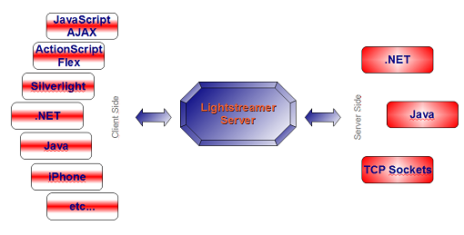

# Lightstreamer - "Hello World" Tutorial - Java SE (AMF) Adapter #
<!-- START DESCRIPTION lightstreamer-example-amfhelloworld-adapter-java -->

This project, of the "Hello World with Lightstreamer" series, will focus on a new feature that was [released](http://cometdaily.com/2010/02/22/lightstreamer-36-released/) with [Lightstreamer Server](http://www.lightstreamer.com/download.htm) since version 3.6: <b>Action Message Format (AMF)</b> support for Flex applications.

First, a quick recap of the previous installments:

- "Hello World" with Lightstreamer: An introduction to Lightstreamer's data model, [Lightstreamer - "Hello World" Tutorial - HTML Client](https://github.com/Weswit/Lightstreamer-example-HelloWorld-client-javascript), and [Lightstreamer - "Hello World" Tutorial - Java Adapter](https://github.com/Weswit/Lightstreamer-example-HelloWorld-adapter-java).
- [Lightstreamer - "Hello World" Tutorial - .NET Adapter](https://github.com/Weswit/Lightstreamer-example-HelloWorld-adapter-dotnet): The .NET API version of the Data Adapter used in the "Hello World" application, showing both a C# and a Visual Basic port.
- [Lightstreamer - "Hello World" Tutorial - TCP Sockets Adapter](https://github.com/Weswit/Lightstreamer-example-HelloWorld-adapter-socket): The TCP-socket-based version of the Data Adapter, suitable for implementation in other languages (PHP, Python, Perl, etc).

Basically, Lightstreamer Server can be seen as a "technology hub" for data push, where you can mix different technologies on the client-side and on the server-side to exchange real-time messages.<br>


We will delve into the "Flex on the client-side, Java on the server-side" scenario and, in this project, full details for the server-side will be provided.<br>

As you may recall form the first installment [Lightstreamer- "Hello World" Tutorial - HTTP Client](https://github.com/Weswit/Lightstreamer-example-HelloWorld-client-javascript), Lightstreamer data push model is based on items made up of fields. A client can subscribe to many items, each with its own schema (a set of fields). Each field is usually a text string with an arbitrary length (from a few characters to large data structures, perhaps based on XML, JSON, etc.). With this new Lightstreamer feature, you can now put a full AMF object into any field and have it pushed from the server to the client in real binary format (with no re-encondings).<br>

The Flex Client library for Lightstreamer has been used for one of the <b>major dealing platforms</b> in the finance field and has undergone many cycles of improvements to make it completely production resilient. We were asked to add native support for AMF objects to improve the performance when streaming complex data structures. So now you can push both text-based items and object-based items to the same Flex application.<br>

When approaching the Lightstreamer <b>data model</b>, it is important to choose the right trade-off between using <i>fine-grained fields and coarse objects</i>. You could map each individual atomic piece of information to a Lightstreamer field, thus using many fields and items, or you could map all your data to a single field of a single item. This applies to both text-based fields (where you can encode coarse objects via JSON, XML, etc.) and object-based fields (via AMF). Usually, going for fine-grained fields is better, because you let Lightstreamer know more about your data structure, so that it will be able to apply optimization mechanisms, like conflation and delta delivery. On the other hand, if you go for huge opaque objects, Lightstreamer will be used more as a blind pipe. But in both cases, you will still benefit from other features, like bandwidth allocation and dynamic throttling. All intermediate scenarios are possible too.<br>

In the sections below, it will be used a single field containing an AMF object derived from a JavaBean. To encode a JavaBean as an AMF object, several ready-made libraries exist. Here we will leverage <b>BlazeDS</b>.<br>

## AMF Lightstreamer Tutorial ##

This project focuses on a simple "Hello World" example to show how to use AMF with our new Flex client library ([docs](http://www.lightstreamer.com/docs/client_flashflexas_asdoc/index.html)). We will create a JavaBean on the server-side and then use it on the client-side.

For this tutorial, I'm assuming you have already read the Basic Hello World example, or that you are already familiar with Lightstreamer concepts.

On the client, the result of this tutorial will be quite similar to the one obtained with the original [Hello World for JavaScript](https://github.com/Weswit/Lightstreamer-example-HelloWorld-client-javascript), but in Flex: we'll get a string alternating some different values (Hello AMF World) and a timestamp. On the server-side, data will be encapsulated into a <b>JavaBean</b> containing a String and a Date instance. This bean will be translated into a byte array and then injected into the Lightstreamer kernel as a single field, instead of being spread over different fields as simple strings (as the original adapter does). Here lies the power of AMF, as you will be able to push even complex JavaBeans to your Flex clients with ease.

<!-- END DESCRIPTION lightstreamer-example-amfhelloworld-adapter-java -->

## Gather Stuff ##

- First of all you'll need a browser, a Flash player, and a JDK: hopefully you already have those :).
- You'll need <b>Lightstreamer Server (Presto or Vivace)</b> and <b>Lightstreamer Flex Client 2.0</b>. You can [download them from the Lightstreamer web site](http://www.lightstreamer.com/download.htm).
- You'll have to compile a Flex application, so you'll need either the [Flex Builder](http://www.adobe.com/mena/products/flex/) or the [Flex SDK](http://opensource.adobe.com/wiki/display/flexsdk/Flex+SDK) (the example works with Flex 3 and Flex 4; use Flex 4 only if you're going to use it with the Flex Builder, otherwise you may have problems with the mxmlc.
- The conversion from Java beans to an AMF-compatible byte array is performed by a couple of the [BlazeDS libraries](http://opensource.adobe.com/wiki/display/blazeds/Release+Builds). Download BlazeDS (binary distribution) and extract flex-messaging-common.jar and flex-messaging-core.jar from it (the downloaded zip contains a .war file, open it with an archive manager and locate the needed libraries under "WEB-INF/lib/").

## Server-Side ##

Now it's time to write the adapter. We'll reuse most of the code of the first Hello World. We'll add a static property and a static utility method to the class we've renamed into "AMFHelloWorld".

```java
private static SerializationContext context = 
  SerializationContext.getSerializationContext();
 
public static byte[] toAMF(Object bean) { 
  ByteArrayOutputStream baos = new ByteArrayOutputStream();
  Amf3Output output = new Amf3Output(context);
  output.setOutputStream(baos);
  try {
    output.writeObject(bean);
    output.flush();
    output.close();
  } catch (IOException e1) {
    e1.printStackTrace();
  }
  return baos.toByteArray();
}
```

The <i>toAMF</i> method receives an Object instance and converts it into an AMF byte array using the <i>Amf3Output</i> class. You can find a list of the conversions performed to switch from Java to AMF in the [ActionMessageOutput class javadoc](http://livedocs.adobe.com/blazeds/1/javadoc/flex/messaging/io/amf/ActionMessageOutput.html#writeObject(java.lang.Object).<br>

In this case we're going to use a Java bean. Note that the <i>AMF3Output class</i> javadoc is currently not linked/listed on [BlazeDS classes list](http://livedocs.adobe.com/blazeds/1/javadoc/overview-tree.html) (they forgot?). You can reach it anyway, at the [logical directory](http://livedocs.adobe.com/blazeds/1/javadoc/flex/messaging/io/amf/Amf3Output.html).

Once the conversion method is in place, we can add the bean we want to send to the clients. We will prepare a simple bean containing only two properties, a String and a Date:

```java
public class HelloBean implements java.io.Serializable {
 
  private static final long serialVersionUID = 7965747352089964767L;
  private String hello;
  private Date now;
 
  public HelloBean() {
  }
 
  public String getHello() {
    return hello;
  }
 
  public void setHello(String hello) {
    this.hello = hello;
  }
 
  public Date getNow() {
    return now;
  }
 
  public void setNow(Date now) {
    this.now = now;
  }
}
```

Finally, we will replace the run method of the <i>GreetingThread</i> inner class with a different implementation that handles our bean:

```java
public void run() {
  int c = 0;
  Random rand = new Random();
  HelloBean testBean = new HelloBean();
  while(go) {
    Map<String,byte[]> data = new HashMap<String,byte[]>();
 
    testBean.setHello(c % 3 == 0 ? "Hello" : c % 3 == 1 ? "AMF" : "World");
    testBean.setNow(new Date());
 
    data.put("AMF_field", toAMF(testBean));
 
    listener.smartUpdate(itemHandle, data, false);
    c++;
    try {
        Thread.sleep(1000 + rand.nextInt(2000));
    } catch (InterruptedException e) {
    }
  }
}
```

As you can see, there's nothing extremely complicated here, we just convert the instance of our bean through the <i>toAMF</i> method and inject it in a Map as if it was a simple String. Then, in turn, the Map is injected into the Lightstreamer kernel to make its way to the clients.

Please find the complete Java Adapter source in the "AMFHelloWorld.java" source file of this project.

## Deploy the Adapter ##

Now just compile the .java file as you would compile any other java application. Remember to add to the classpath the "ls-adapter-interface.jar" file (from LS_HOME/DOCS-SDKs/sdk_adapter_java/lib), "flex-messaging-common.jar" and "flex-messaging-core.jar" (from BlazeDS). You will obtain three class files: AMFHelloWorld.class, AMFHelloWorld$HelloBean.class and AMFHelloWorld$GreetingsThread.class. Now create an "AMFHelloWorld" folder under "LS_HOME/adapters" and a "classes" folder inside it: put the .class files there.

Finally, create an adapters.xml file under the LS_HOME/adapters/AMFHelloWorld folder:

```xml
<?xml version="1.0"?>
 
<adapters_conf id="AMFHELLOWORLD">
  <metadata_provider>
    <adapter_class>
      com.lightstreamer.adapters.metadata.LiteralBasedProvider
    </adapter_class>
  </metadata_provider>
  <data_provider>
    <adapter_class>AMFHelloWorld</adapter_class>
  </data_provider>
</adapters_conf>
```

As anticipated, while assembling the client [Lightstreamer - "Hello World Tutorial - Flex (AMF) Client"](https://github.com/Weswit/Lightstreamer-example-AMFHelloWorld-client-flex) we're going to use "AMFHELLOWORLD" as the adapter set name, while we'll use the classic LiteralBasedProvider as our Metadata Adapter and our brand new AMFHelloWorld class as our Data Adapter.<br>

Please note that the [latest release](https://github.com/Weswit/Lightstreamer-example-AMFHelloWorld-adapter-java/releases) of this project contains an alternative deploy folder with a jar file instead of .class ones.

## Ready to Go ##

Please, in order to test this adapter follow the steps in [Lightstreamer - "Hello World" Tutorial - Flex (AMF) Client](https://github.com/Weswit/Lightstreamer-example-AMFHelloWorld-client-flex).

## Final Notes ##

You've seen how to push Objects instead of Strings from a Lightstreamer server to a Flex client. You can exploit this technique to push complex data structures, but obviously, doing so you'll lose some of the optimizations offered by Lightstreamer protocol. For example, the merging algorithm (of the MERGE mode) is applied to the entire bean instead of being applied to each single field, so that every time a property within the bean changes, the entire bean is pushed to the client, not only the changed value. As with anything regarding engineering you'll have to choose the trade-off that optimizes properly for your application.

Please also consider that the Flex client library in this tutorial is not available with the Moderato version of Lightstreamer Server, so you may want to use a [DEMO license](http://www.lightstreamer.com/download) for Lightstreamer Presto/Vivace to experiment with it.

# See Also #

## Clients Using This Adapter ##
<!-- START RELATED_ENTRIES -->

* [Lightstreamer - "Hello World" Tutorial - Flex (AMF) Client](https://github.com/Weswit/Lightstreamer-example-AMFHelloWorld-client-flex)

<!-- END RELATED_ENTRIES -->

## Related Projects ##

* [Lightstreamer - "Hello World" Tutorial - HTML Client](https://github.com/Weswit/Lightstreamer-example-HelloWorld-client-javascript)
* [Lightstreamer - "Hello World" Tutorial - Java Adapter](https://github.com/Weswit/Lightstreamer-example-HelloWorld-adapter-java)
* [Lightstreamer - "Hello World" Tutorial - .NET Adapter](https://github.com/Weswit/Lightstreamer-example-HelloWorld-adapter-dotnet)

# Lightstreamer Compatibility Notes #

- Compatible with Lightstreamer Flex Client Library version 2.0 or newer.
- For Lightstreamer Allegro (+ Flex Client API support), Presto, Vivace.
